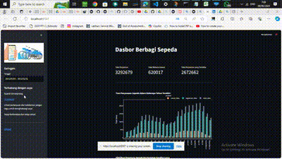

# Bike Rental Analysis


This repository contains the final project for the "Belajar Analisis Data Dengan Python" course on Dicoding, focusing on analysis and dashboard creation using the bike sharing dataset. The project involves data wrangling, exploratory data analysis (EDA), and data visualization techniques. Additionally, a dashboard was created using Streamlit.

## File Structures
```
├── .streamlit
├── Dashboard
│   ├── dashboard_bike.py
│   └── day.csv
├── Dataset
│   ├── day.csv
│   ├── hour.csv
|   └── Readme.txt
├── README.md
├── notebook1.ipynb
└── requirements.txt

```

## Project Workflow
1. **Data Wrangling**:
   - **Gathering Data**: Obtain data from various sources.
   - **Assessing Data**: Evaluate data quality, completeness, and structure.
   - **Cleaning Data**: Address data issues such as missing values, duplicates, and inconsistencies.

2. **Exploratory Data Analysis (EDA)**:
   - **Define Business Questions for Data Exploration**: Identify specific questions to guide the analysis.
   - **Conduct Data Exploration**: Examine data to uncover patterns, trends, and insights.

3. **Data Visualization**:
   - **Create Data Visualizations that Answer Business Questions**: Generate visual representations of data to address the identified business questions.

4. **Dashboard Creation**:
   - **Set up the DataFrame for Dashboard**: Prepare data for dashboard creation.
   - **Implement Filter Components**: Incorporate interactive filters for data exploration.
   - **Populate the Dashboard with Visualizations**: Present relevant visualizations to provide insights and facilitate decision-making.

### For `dashboard_bike.py`:
1. Download the project.
2. Install Streamlit in your terminal or command prompt using pip install streamlit. Install other required libraries like pandas, matplotlib, seaborn, and plotly using separate pip install commands. Alternatively, you can install all required libraries at once by running pip install -r requirements.txt.
3. Note: Do not move the CSV file as it serves as the data source. Keep it in the same folder as dashbboard_bike.py.
4. Open your preferred text editor (e.g., VSCode) and run the file by executing `streamlit run Dashboard/dashboard_bike.py` in the terminal.
